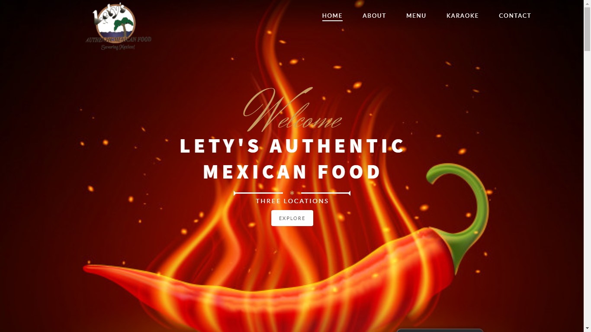

# Letys-Restaurant-Web-Page

## Description 

Welcome to our official website for Lety's Restauant (3 locations) in Fresno, California! 

Our client is constantly busy working at their restaurant, so we decided to help them out by giving them a free website! The application is simple, beautiful, and easy to use.

We have a Navbar with clickable elements that directs users to the corresponding section. There are Home, About, Menu, Karaoke, and Contact sections.

Some sections are not fully complete yet and may have placeholder text or images, but the general layout and UI are mostly final.

We've also implemented some APIs. At the bottom you will find a a Google Map, complete with the three restaurants' locations pinned. You will also see a weather API right above it. This is to tell whether or not you should bring an umbrella when going out to the restaurant. 

Finally, we've employed some minimal client-side storage, at the bottom of the screen. Input your email and press save to receive a (tentative) e-mail newsletter from the restaurant. Refresh the page and your email's still there. Now you don't have to remember whether or not you wrote anything. Hooray!

We hope you enjoy our first stage of this project. We think it is beautiful, and we're sure you will think so too. If you have any questions or comments, please feel free to email us at kasper.kuzmicki@yahoo.com. Have a great day!

## Application Link

https://ocampmaria.github.io/Letys-Restaurant-Web-Page/

## Image 

## Licence 

Copyright (c) Team "Power Rangers" 

All rights reserved.

## Badges

